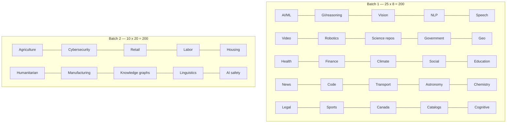

# 400 Dataset Websites

**400 curated dataset-source websites, organized into 35 categories.**

| | |
|---|---|
| **Full combined list** | [DATASET_WEBSITES.md](DATASET_WEBSITES.md) |
| **Batch 2 only (201-400)** | [DATASET_WEBSITES_BATCH2.md](DATASET_WEBSITES_BATCH2.md) |
| **Entries** | 400 |
| **Categories** | 35 |
| **Compiled** | August 2026 |

## Category chart

## Batch 2 — 10 new categories (sites 201–400)

26. Agriculture, Food & Fisheries
27. Cybersecurity, Networks & Threat Intelligence
28. Retail, E-commerce & Marketing
29. Labor, Jobs & Skills
30. Housing, Real Estate & Urban Planning
31. Humanitarian, Disaster & Crisis
32. Manufacturing, Industry & Supply Chain
33. Knowledge Graphs & Linked Open Data
34. Linguistics, Translation & Low-Resource Languages
35. AI Safety, Alignment, Ethics & Red-Teaming

Tables: [DATASET_WEBSITES_BATCH2.md](DATASET_WEBSITES_BATCH2.md)

Licenses vary. Read host terms before commercial use.
