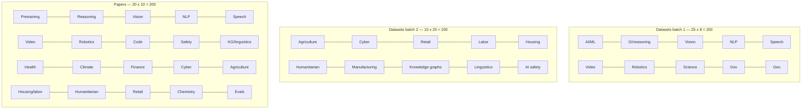

# 400 Dataset Websites + 200 Papers

Curated catalog of dataset-source websites and the papers that introduced them.

| | |
|---|---|
| **Datasets batch 1** | [DATASET_WEBSITES.md](DATASET_WEBSITES.md) (sites 1–200, 25 categories) |
| **Datasets batch 2** | [DATASET_WEBSITES_BATCH2.md](DATASET_WEBSITES_BATCH2.md) (sites 201–400, 10 categories) |
| **Papers (full)** | [PAPERS.md](PAPERS.md) (200 papers, 20 categories, GitHub stars) |
| **Papers 1–100** | [PAPERS_PART1.md](PAPERS_PART1.md) |
| **Papers 101–200** | [PAPERS_PART2.md](PAPERS_PART2.md) |
| **1,100 starred repos** | [STARRED_CLASSIFIED.md](STARRED_CLASSIFIED.md) (mapped onto the existing 35 lists) |
| **Merged into lists 1–35** | Each existing category list now has a *Starred GitHub repos added to list N* subsection |
| **List 32 (CAD / manufacturing)** | Full 35-row starred table under category 32 in [DATASET_WEBSITES_BATCH2.md](DATASET_WEBSITES_BATCH2.md) |
| **Compiled** | August 2026 |

## Category chart

## Paper categories

1. Pretraining corpora & data hubs
2. General intelligence & reasoning benchmarks
3. Computer vision datasets
4. NLP / NLU benchmarks
5. Speech & audio
6. Video & multimodal
7. Robotics, RL & embodied AI
8. Code datasets & coding evals
9. AI safety, alignment & red-teaming
10. Knowledge graphs & linguistics
11. Health, biomedical & genomics
12. Climate, Earth & geospatial
13. Finance & economics
14. Cybersecurity & networks
15. Agriculture & food
16. Housing, labor & social surveys
17. Humanitarian & disaster
18. Recommenders, retail & consumer
19. Chemistry, materials & life-science data
20. Evaluation methods, arenas & meta-benchmarks

Each paper row has: title, year, venue, related dataset, link (arXiv / PDF / project), and GitHub stars of the official repo when one exists. `—` means unverified or no public repo.

Licenses vary. Read host terms before commercial use.
