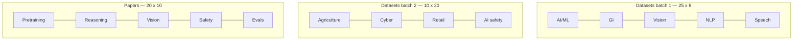

# 400 Dataset Websites + 200 Papers

Curated catalog of dataset-source websites and the papers that introduced them.

| | |
|---|---|
| **Datasets batch 1** | [DATASET_WEBSITES.md](DATASET_WEBSITES.md) (1–200, 25 categories) |
| **Datasets batch 2** | [DATASET_WEBSITES_BATCH2.md](DATASET_WEBSITES_BATCH2.md) (201–400, 10 categories) |
| **Papers** | [PAPERS.md](PAPERS.md) (200 papers, 20 categories, GitHub stars) |
| **Compiled** | August 2026 |

## Category chart

## Paper categories

1. Pretraining corpora & data hubs
2. General intelligence & reasoning benchmarks
3. Computer vision datasets
4. NLP / NLU benchmarks
5. Speech & audio
6. Video & multimodal
7. Robotics, RL & embodied AI
8. Code datasets & coding evals
9. AI safety, alignment & red-teaming
10. Knowledge graphs & linguistics
11. Health, biomedical & genomics
12. Climate, Earth & geospatial
13. Finance & economics
14. Cybersecurity & networks
15. Agriculture & food
16. Housing, labor & social surveys
17. Humanitarian & disaster
18. Recommenders, retail & consumer
19. Chemistry, materials & life-science data
20. Evaluation methods, arenas & meta-benchmarks

Stars in PAPERS.md are official-repo GitHub stars checked August 2026. `\u2014` means unverified or no public repo.
