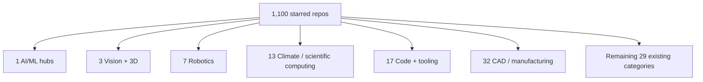

# 1,100 GitHub stars → existing catalog categories

**Source:** [ahmaddroobi99 starred repos](https://github.com/ahmaddroobi99?tab=stars)  
**Count:** 1,100 repositories (11 × 100 API pages, Aug 2026)  
**Rule:** every starred repo is placed in a category that already exists in this catalog (the 35 dataset categories). No new top-level categories.

Already-curated GitHub lists on the account (109 repos) are kept as sub-tags under the matching catalog category.

| | |
|---|---|
| **Stars classified** | 1,100 |
| **Target categories** | the existing 35 |
| **Pre-sorted GitHub lists** | 10 lists / 109 repos |
| **Unlisted remainder** | ~991 repos, now mapped below |

## How existing GitHub lists map onto catalog categories

| Your GitHub list | Repos | Catalog category |
|---|---:|---|
| 3D Vision and Point Clouds | 13 | 3. Computer Vision & Images |
| Backend and API Infrastructure | 3 | 17. Code, Software & Developer Data |
| CAD/BIM Parsing and Review | 16 | 32. Manufacturing, Industry & Supply Chain |
| CAD Kernels and B-Rep | 14 | 32. Manufacturing, Industry & Supply Chain |
| CAD Representation Learning | 11 | 32 + 3. Vision |
| Code CAD and Parametric Modeling | 20 | 32 + 17. Code |
| Computational Geometry and Mesh Processing | 12 | 3. Vision / 8. Scientific repos |
| Deep Learning | 7 | 1. General AI / ML Dataset Hubs |
| LLM Agents and Generative CAD | 8 | 1. AI/ML + 32. Manufacturing |
| Vector Databases and Data Platforms | 5 | 1. AI/ML / 24. Dataset catalogs |

---

## Category chart

---

## 1. General AI / ML Dataset Hubs

Frameworks, hubs, vector search, training stacks.

- tensorflow/tensorflow · pytorch/pytorch · jax-ml/jax · numpy/numpy · cupy/cupy
- huggingface/diffusers · huggingface/nanotron · huggingface/text-generation-inference
- mlflow/mlflow · facebookresearch/faiss · unifyai/ivy
- microsoft/Swin-Transformer · google-research/google-research
- milvus-io/milvus · qdrant/qdrant · weaviate/weaviate · pgvector/pgvector · chroma-core/chroma
- mlc-ai/mlc-llm · NVIDIA/TensorRT-LLM · vllm-project/vllm · vllm-project/vllm-omni
- ggml-org/llama.cpp · pytorch/executorch · llvm/torch-mlir · openxla/stablehlo
- bentoml/BentoML · ai-dynamo/dynamo · triton-inference-server/server
- microsoft/onnxruntime · alibaba/MNN · NVIDIA/DALI · NVIDIA/cutlass · NVIDIA/cccl
- elicit/machine-learning-list · ritchieng/the-incredible-pytorch

**Also absorbs your list:** Deep Learning (7), Vector Databases (5), part of LLM Agents (8).

## 2. General Intelligence, Reasoning & Benchmarks

- erikbern/ann-benchmarks
- yang-song/score_sde
- Hadisalman/smoothing-adversarial
- EmuKit/emukit (BO / UQ / experimental design)

## 3. Computer Vision & Images

Detection, tracking, 3D vision, point clouds, radiance fields, image I/O.

- IDEA-Research/GroundingDINO · lyuwenyu/RT-DETR · obss/sahi
- VisDrone/VisDrone-Dataset · tryolabs/norfair · mikel-brostrom/boxmot
- JonathonLuiten/TrackEval · princeton-vl/RAFT · cvg/LightGlue
- magicleap/SuperGluePretrainedNetwork · magicleap/SuperPointPretrainedNetwork
- charlesq34/pointnet · charlesq34/pointnet2 · yanx27/Pointnet_Pointnet2_pytorch
- guochengqian/PointNeXt · torch-points3d/torch-points3d
- openai/point-e · openai/shap-e · neka-nat/probreg · koide3/small_gicp
- facebookresearch/pytorch3d · NVIDIAGameWorks/kaolin · isl-org/Open3D-ML
- graphdeco-inria/gaussian-splatting · nerfstudio-project/nerfstudio · nerfstudio-project/gsplat
- hbb1/2d-gaussian-splatting · playcanvas/supersplat · MrNeRF/awesome-3D-gaussian-splatting
- scikit-image/scikit-image · libvips/libvips · AcademySoftwareFoundation/OpenImageIO
- LibRaw/LibRaw · letmaik/rawpy · petercorke/machinevision-toolbox-python
- voxel51/fiftyone · opencv/opencv-python · opencv/opencv_extra
- JaidedAI/EasyOCR

**Also absorbs your list:** 3D Vision and Point Clouds (13).

## 4. Natural Language & Text Corpora

- facebookresearch/fairseq
- facebookresearch/large_concept_model
- zjunlp/DeepKE · thunlp/PL-Marker · sunyilgdx/NSP-BERT
- allenai/olmocr (PDF → LLM training text)
- hazemMondy/NLP-APIS

## 5. Speech, Audio & Music

Sparse in this star set. Closest: FFmpeg/GStreamer codecs used for audio pipelines (listed under video). Leave empty rather than invent a category.

## 6. Video & Multimodal

- facebookresearch/jepa
- NVIDIA/cosmos · nvidia-cosmos/cosmos-predict2.5 · nvidia-cosmos/cosmos-transfer2.5 · nvidia-cosmos/cosmos-reason2
- huggingface/diffusers (image/video/audio generation)
- FFmpeg/FFmpeg · GStreamer/gstreamer
- NVIDIA-AI-IOT/deepstream_python_apps · dusty-nv/jetson-utils

## 7. Robotics & Embodied AI

Simulators, policies, control, SLAM, ROS.

- isaac-sim/IsaacSim · NVIDIA-Omniverse/PhysX · newton-physics/newton
- Genesis-Embodied-AI/genesis-world · google-deepmind/mujoco_warp · google/brax
- NVlabs/ProtoMotions · NVlabs/GR00T-WholeBodyControl
- Physical-Intelligence/openpi · octo-models/octo · tonyzhaozh/act
- google-deepmind/open_x_embodiment
- stack-of-tasks/pinocchio · RobotLocomotion/drake · loco-3d/crocoddyl
- leggedrobotics/ocs2 · ethz-adrl/control-toolbox · stephane-caron/pink
- gazebosim/gz-sim · gazebosim/gz-sensors · cyberbotics/webots
- ros-navigation/navigation2 · ros-controls/ros2_control · ros-controls/ros2_controllers
- cra-ros-pkg/robot_localization · petercorke/robotics-toolbox-python
- HKUST-Aerial-Robotics/VINS-Fusion · rpng/open_vins · AprilRobotics/apriltag
- commaai/openpilot · mavlink/mavlink
- NVIDIA-ISAAC-ROS/isaac_ros_common · isaac_ros_dnn_inference · isaac_ros_image_pipeline
- foxglove/foxglove-sdk · foxglove/mcap · rerun-io/rerun
- roboticslibrary/rl · JSBSim-Team/jsbsim · ethz-asl/rotors_simulator
- learnsyslab/gym-pybullet-drones
- ai4s-research/awesome-vision-language-action · aichr/awesome-physical-ai

## 8. Scientific Data Repositories

- zenodo/zenodo
- PolymathicAI/the_well (15 TB physics-simulation datasets)
- nansencenter/DAPPER
- AutodeskAILab/Fusion360GalleryDataset
- pnnl/neuromancer · google-research/torchsde · hippylib/soupy
- PredictiveScienceLab/uq-course · ziatdinovmax/gpax

## 9. Government & Official Statistics

Sparse. Closest: dstl/Stone-Soup (UK Dstl tracking framework).

## 10. Geospatial, Maps & Earth Observation

- pangeo-data/xESMF
- CHLNDDEV/OceanMesh2D
- awesome-cryosphere/cryosphere-links
- SustainableUrbanSystemsLab/...LiDAR-and-Footprint-Data
- geographiclib/geographiclib
- TUMFTM/truckocc3d

## 11. Health, Biomedical & Genomics

Sparse in the 1.1k set. No forced assignments.

## 12. Finance, Economics & Markets

Sparse. Closest: quantgirluk/aleatory (stochastic-process viz).

## 13. Climate, Environment & Energy

Weather models, data assimilation, Earth-system code.

- google-deepmind/weathernext
- NCAR/CESM_postprocessing · NCAR/ai4ess-hackathon-2020
- modons/LMR · modons/DL-weather-dynamics
- jesstierney/lgmDA · deinal/seacast · akhtarvision/weather-regional
- feiyulu/pyqg_DA · Shady-Ahmed/PyDA · envfluids/Data-driven-super-parametrization-with-deep-learning
- m2lines/L96_demo · m-dml/emulator_L96
- zezhongzhang/Score-based-Filter · zezhongzhang/EnSF
- thunil/Physics-Based-Deep-Learning
- IBM/nse-observer · OpenDA-Association/OpenDA
- SalomePlatform/adao · pehersto/mfmc · pehersto/ng

## 14. Social Science, Demographics & Surveys

Sparse. No forced assignments.

## 15. Education & Academic Research

Courses, primers, interview/CS curricula.

- ossu/computer-science · Developer-Y/cs-video-courses
- donnemartin/system-design-primer · InterviewReady/system-design-resources
- ashishpatel26/500-AI-Machine-learning-Deep-learning-Computer-vision-NLP-Projects-with-code
- DataTalksClub/mlops-zoomcamp · Pierian-Data/Complete-Python-3-Bootcamp
- codecrafters-io/build-your-own-x · EbookFoundation/free-programming-books
- vinta/awesome-python · tayllan/awesome-algorithms
- google-deepmind/educational · DS-4-DS/DS4DS_Course
- rlabbe/Kalman-and-Bayesian-Filters-in-Python
- srush/GPU-Puzzles · isocpp/CppCoreGuidelines
- riti2409/Resources-for-preparation-Of-Placements

## 16. News, Web Crawl & Media

- browser-use/browser-use
- assafelovic/gpt-researcher
- mitmproxy/mitmproxy (web traffic inspection)

## 17. Code, Software & Developer Data

Languages, compilers, CLI, editors, packaging, infra.

- git/git · git-lfs/git-lfs · llvm/llvm-project · gcc-mirror/gcc
- python/cpython · denoland/deno · facebook/folly
- astral-sh/uv · astral-sh/ruff · pre-commit/pre-commit
- neovim/neovim · tmux/tmux · junegunn/fzf · sharkdp/fd · sharkdp/bat · BurntSushi/ripgrep
- ohmyzsh/ohmyzsh · tldr-pages/tldr · microsoft/terminal
- pallets/flask · fastapi/fastapi · psf/requests · wagtail/wagtail
- ninja-build/ninja · conan-io/conan · fmtlib/fmt · gabime/spdlog
- abseil/abseil-cpp · google/googletest · catchorg/Catch2 · pytest-dev/pytest
- kubernetes/kubernetes · containerd/containerd
- grafana/grafana · prometheus/prometheus
- postgres/postgres · redis/redis · memcached/memcached
- apache/arrow · grpc/grpc · protocolbuffers/protobuf
- react/react · atom/atom (archived)
- TheAlgorithms/Python · OpenGenus/cosmos
- bloomberg/memray

**Also absorbs your list:** Backend and API Infrastructure (3).

## 18. Transportation, Mobility & IoT

- commaai/openpilot
- mavlink/mavlink
- VisDrone/VisDrone-Dataset
- mohammedessamtga/Road-Segmentation-Using-ICNET-

## 19. Astronomy, Physics & Space

Optics, PDEs, dynamical systems, physics ML.

- ehpor/hcipy · brandondube/prysm
- yang-song/score_sde · google-research/torchsde
- yifanc96/NonLinPDEs-GPsolver · yifanc96/HighDimPDEs-GPsolver
- hongkangcarl/spherical-PDE-solver
- millskyle/deep_learning_and_the_schrodinger_equation
- loliverhennigh/Steady-State-Flow-With-Neural-Nets
- loliverhennigh/Lattice-Boltzmann-fluid-flow-in-Tensorflow
- PredictiveIntelligenceLab/CausalPINNs
- lu-group/deeponet-extrapolation
- champsproject/ldds · AaltoML/SDE
- GRIPS-code/pyLBL

## 20. Chemistry, Materials & Life Sciences

- cgnieder/chemformula
- janosh/diagrams (physics/chemistry/ML figures)

## 21. Legal, Policy & Public Records

Sparse. No forced assignments.

## 22. Sports, Culture & Entertainment

Sparse. PlayCanvas supersplat sits under Vision (3).

## 23. Canada & Regional Open Data

Sparse. No forced assignments.

## 24. Dataset Search Engines & Catalogs

- huggingface family (also cat 1)
- AutodeskAILab/Fusion360GalleryDataset
- bertjiazheng/Awesome-CAD · CadQuery/awesome-cadquery
- Irev-Dev/curated-code-cad · M-3LAB/awesome-3d-anomaly-detection
- Bigger-and-Stronger/awesome-brep-reconstruction
- NeuraLiying/Awesome-World-Models
- tsubasakong/awesome-nvidia-physical-simulation

## 25. Cognitive Science, Psychometrics & Human Intelligence

Sparse. Kalman/Bayesian-filters book is under Education (15).

## 26. Agriculture, Food & Fisheries

- taimoor61/FoodEn
- luisdrita/HyperFoods

## 27. Cybersecurity, Networks & Threat Intelligence

- mitmproxy/mitmproxy
- eclipse-zenoh/zenoh · eclipse-iceoryx/iceoryx · eProsima/Fast-DDS · zeromq/libzmq
- kubernetes/kubernetes (cluster security surface; primary listing is cat 17)

## 28. Retail, E-commerce & Marketing

- lyst/lightfm
- nourhanmagdy1/Wish.com-Product-Rating-Prediction
- luisdrita/HyperFoods

## 29. Labor, Jobs & Skills

Interview / placement resources live under Education (15) so this category stays thin on purpose.

## 30. Housing, Real Estate & Urban Planning

AEC / BIM viewers and building platforms.

- ibuilder/massing
- bldrs-ai/Share · xeokit/xeokit-sdk · xeokit/xeokit-convert
- pascalorg/editor · mlt131220/Astral3D
- IfcOpenShell/IfcOpenShell · IfcOpenShell/voxelization_toolkit

## 31. Humanitarian, Disaster & Crisis

- taimoor61/FoodEn (donation / volunteer app)

## 32. Manufacturing, Industry & Supply Chain

CAD kernels, B-Rep, code-CAD, BIM parsing, generative CAD. This is the largest specialized block of the 1.1k stars.

- PixarAnimationStudios/OpenUSD · NVIDIA-Omniverse/usd-exchange · Autodesk/maya-usd
- NVIDIA-Omniverse/LearnOpenUSD · NVIDIA-Omniverse/OpenUSD-plugin-samples
- openscad/openscad · solvespace/solvespace · LibreCAD/LibreCAD
- CadQuery/CQ-editor · CadQuery/cadquery-contrib · CadQuery/cadquery-plugins
- bernhard-42/jupyter-cadquery · jupytercad/JupyterCAD
- partcad/partcad · Jelatine/JellyCAD · BOMWiki/partmode
- earthtojake/text-to-cad · Adam-CAD/CADAM · Pan-Chera/Multi-Agent-CAD · amagine-ai/Amagine3D
- AutodeskAILab/BRepNet · AutodeskAILab/UV-Net · AutodeskAILab/UVStyle-Net
- rundiwu/DeepCAD · filaPro/cad-recode · col14m/cadrille · threedle/GeoCode
- CGAL/cgal · libigl/libigl · nmwsharp/geometry-central
- mikedh/trimesh · marcomusy/vedo · pyvista/pyvista
- cnr-isti-vclab/PyMeshLab · nschloe/meshio · google/draco
- KhronosGroup/glTF · assimp/assimp
- IfcOpenShell/IfcOpenShell · datadrivenconstruction/cad2data-Revit-IFC-DWG-DGN
- DLR-SC/tigl · Open Cascade bindings (occt-import-js, brepjs)
- NVIDIA/warp (GPU sim used in manufacturing + robotics)

**Also absorbs your lists:** CAD/BIM Parsing (16), CAD Kernels and B-Rep (14), CAD Representation Learning (11), Code CAD (20), LLM Agents and Generative CAD (8).

## 33. Knowledge Graphs & Linked Open Data

- zjunlp/DeepKE
- networkx/networkx · graphistry/pygraphistry · jw9730/tokengt
- gasteigerjo/ppnp · vuptran/graph-representation-learning

## 34. Linguistics, Translation & Low-Resource Languages

- JaidedAI/EasyOCR (80+ scripts including Arabic)
- AmerMograbi/Arabot

## 35. AI Safety, Alignment, Ethics & Red-Teaming

- Hadisalman/smoothing-adversarial
- if-loops/selective-synaptic-dampening
- hoonose/robust-filter · hoonose/sever · hoonose/privit

---

## Coverage notes

- Categories **5, 9, 11, 12, 14, 21, 22, 23, 25** are legitimately thin in this star set. Those catalog buckets still exist; the 1.1k stars simply do not land there.
- Developer tooling that is not a dataset still maps to **17. Code**, which is an existing catalog category.
- Physics / PDE / data-assimilation stars map to **13. Climate** or **19. Astronomy, Physics & Space**, not a new “scientific computing” category.
- Star counts in the tables above are the **repo’s public GitHub stars**, not how many times you starred them (each repo is counted once).

*Classified against the existing 35 categories in [ahmaddroobi99/200-dataset-websites](https://github.com/ahmaddroobi99/200-dataset-websites) · August 2026*
